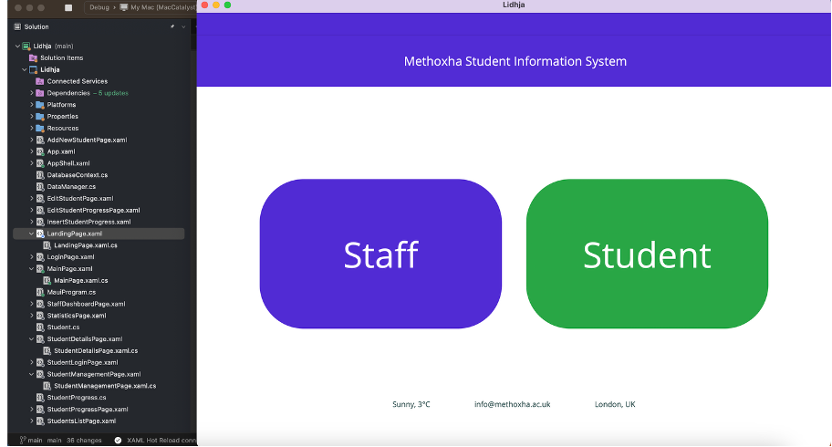
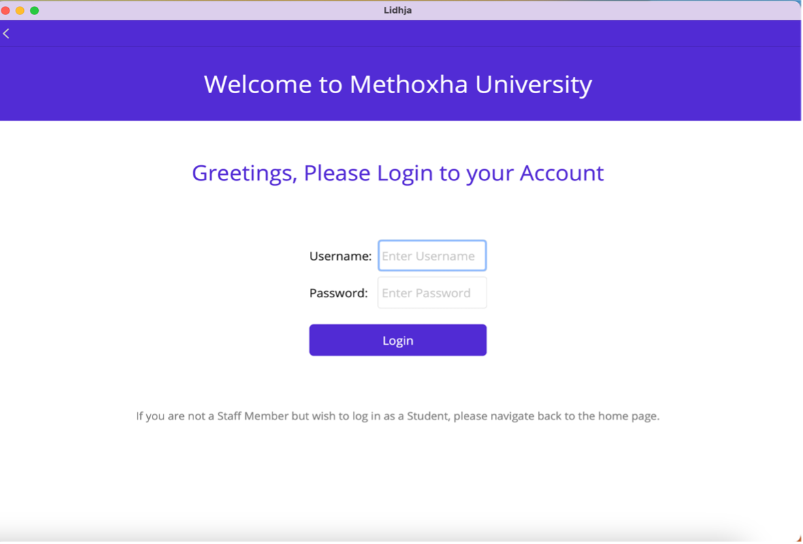
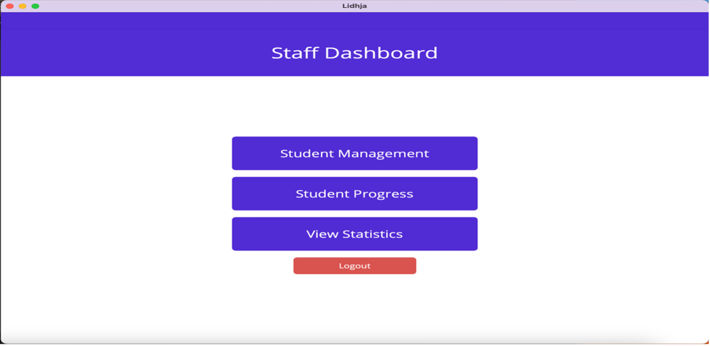
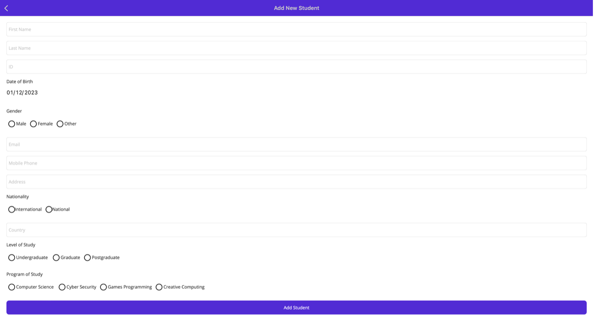
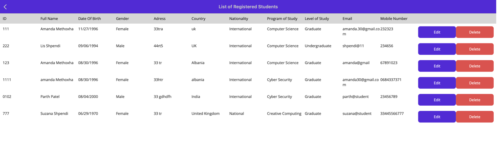

# Student Information System (SIS)

Real-time student records and analytics for staff and students — from one cross-platform app built with .NET MAUI, C#, and SQLite.

---

## Table of contents
- [Overview](#overview)
- [Features](#features)
- [Tech stack](#tech-stack)
- [Architecture](#architecture)
- [Screenshots](#screenshots)
- [Getting started](#getting-started)
  - [Prerequisites](#prerequisites)
  - [Clone & run](#clone--run)
  - [Running by platform](#running-by-platform)
  - [Database](#database)
- [Project structure](#project-structure)
- [Configuration](#configuration)
- [Quality & security](#quality--security)
- [Roadmap](#roadmap)
- [Contributing](#contributing)
- [License](#license)

---

## Overview
The Student Information System (SIS) is a cross-platform application that lets **staff** manage students, courses, grades, notes, and statistics, while **students** can view their personal details, course information, grades, and announcements in real time. It’s designed for speed, reliability, and maintainability, with a single .NET codebase targeting Windows, Android, iOS (and optionally macOS).

**Why it exists**
- Replace scattered spreadsheets and legacy tools with a single source of truth.
- Improve visibility of academic progress and demographics (performance, gender, nationality).
- Make day-to-day admin faster with a snappy UI and clear workflows.

---

## Features
- **Role-based access** — Secure login for **Staff** and **Students** with tailored permissions.
- **Student management (CRUD)** — Create, read, update, and delete student records and personal details.
- **Courses & grades (CRUD)** — Manage courses/subjects and enter or update scores.
- **Analytics** — View performance, gender, and nationality statistics to support decisions.
- **Notes/announcements** — Post staff notes and updates students can see immediately.
- **Cross-platform** — Built with .NET MAUI to run on Windows, Android, iOS (and macOS with Catalyst).

---

## Tech stack
- **Languages & Frameworks:** C# (.NET 7), .NET MAUI (XAML UI)
- **Database:** SQLite (file-based, embedded)
- **IDE & Tools:** Visual Studio 2022; .NET CLI; MAUI workloads
- **Architecture:** MVVM (Models, Views, ViewModels), dependency injection for services
- **Process:** Agile/iterative development with testing focus

---

## Architecture
- **Presentation:** .NET MAUI XAML pages with MVVM bindings
- **Domain:** Models for Students, Courses, Scores, Users, Notes
- **Data:** SQLite database with a lightweight data access layer (repository/service pattern)
- **Services:** Authentication, student/course/score management, statistics/analytics
- **Platforms:** Shared code plus platform-specific projects under `Platforms/`

---

## Screenshots

  
  
  

  
  

---

## Getting started

### Prerequisites
- **.NET 7 SDK** (verify with `dotnet --list-sdks`)
- **Visual Studio 2022** with **.NET Multi-platform App UI development** workload
- **MAUI workloads** (CLI): `dotnet workload install maui`
- **Windows** for Win UI; **Android SDK**/emulator for Android; **macOS + Xcode** for iOS/macOS builds

### Clone & run
bash
# 1) Clone
git clone https://github.com/AmandaMethoxha/student-information-system.git
cd student-information-system

# 2) Restore & build
dotnet restore

# 3) Run (choose a target below or use Visual Studio to run/debug)

### Running by platform > Pick one target at a time:

bash
# Windows
dotnet build -t:Run -f net7.0-windows10.0.19041.0

# Android (device or emulator must be running)
dotnet build -t:Run -f net7.0-android

# iOS (on macOS with configured signing)
dotnet build -t:Run -f net7.0-ios

# Mac Catalyst (on macOS)
dotnet build -t:Run -f net7.0-maccatalyst
### Database 
* Uses **SQLite** for a lightweight, cross‑platform store. 
* On first run, the app creates the database file (e.g., in app data) and applies initial schema. 
* To reset development data, delete the local SQLite file and relaunch. 

--- 

## Project structure

SIS/
├─ App.xaml / App.xaml.cs               # App bootstrapping, DI setup
├─ MainPage.xaml / MainPage.xaml.cs     # Entry page / navigation
├─ Models/                              # Student, Course, Score, User, Note, etc.
├─ ViewModels/                          # MVVM view models
├─ Views/                               # XAML pages (StudentsPage, CoursesPage, etc.)
├─ Services/                            # Data access, Auth, Statistics services
├─ Resources/                           # Styles, fonts, images
├─ Platforms/                           # Android, iOS, MacCatalyst, Windows specifics
├─ Data/                                # Database helpers / migrations (if applicable)
└─ docs/                                # README assets (images)

---

## Configuration

* **App settings:** Defaults are embedded; no secrets are required for local dev.
* **SQLite path:** The database file is created in a platform‑appropriate app data folder.
* **Seeding (optional):** Add a seed routine in the data layer to pre‑populate sample students/courses for demos.

---

## Quality & security

* **Performance:** Aims for sub‑2‑second interactions for common tasks.
* **Availability:** Designed for high availability during school hours.
* **Privacy:** GDPR‑aware design; only the minimum personal data required is stored; clear user roles and access controls.
* **Testing:** Unit tests (where applicable) around services and data access; manual test scripts for UI flows.

---

## Roadmap

* [ ] Export reports (CSV/PDF)
* [ ] Advanced filtering and search
* [ ] Role management UI (create/assign roles) 
* [ ] Cloud sync option (e.g., Azure/EF Core provider)
* [ ] Localization (i18n) and accessibility polish

---

## Contributing

Contributions are welcome! Please open an issue to discuss changes or submit a PR:
1. Fork the repo
2. Create a feature branch: git checkout -b feature/xyz
3. Commit your changes: git commit -m "feat: add xyz"
4. Push and open a PR

---

## License

This project is licensed under the **MIT License*
